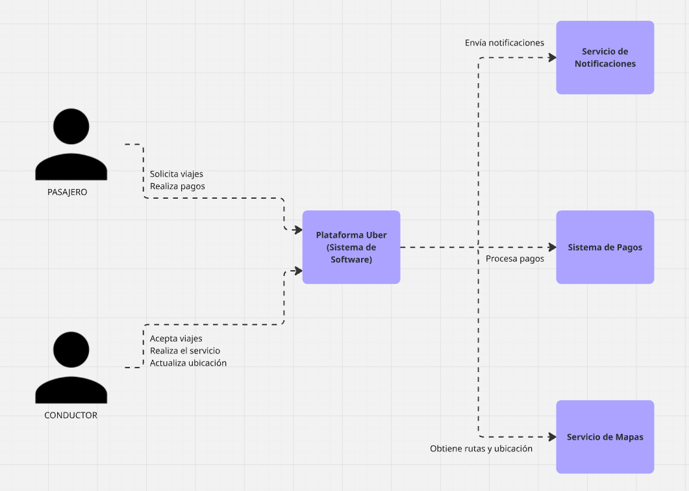
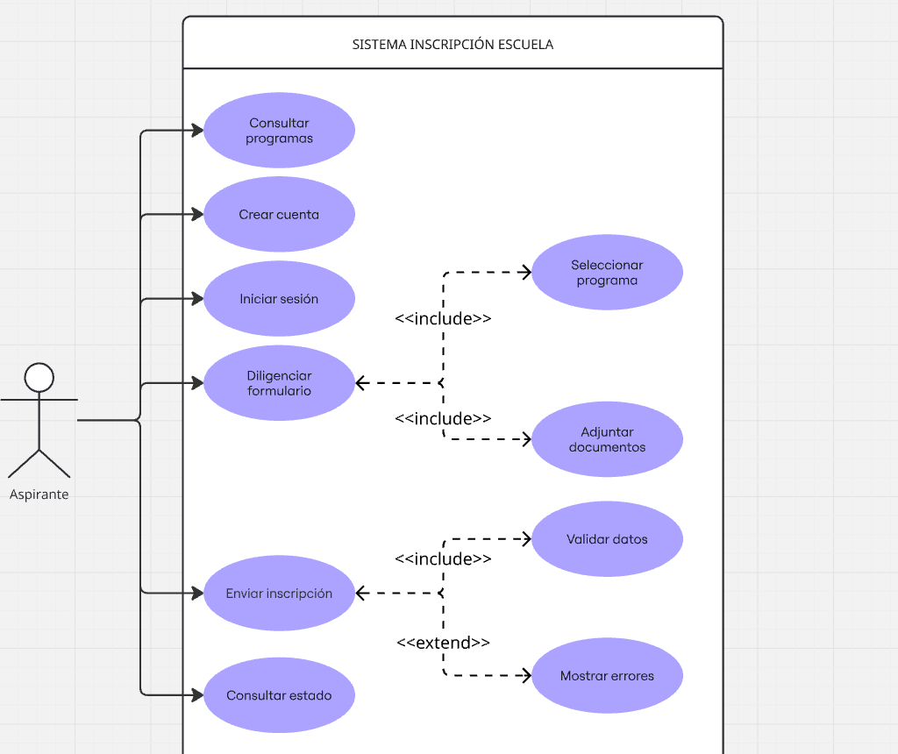

# DIAGRAMA DE CONTEXTO UBER 

---

# EJERCICIO ANALISIS DE REQUERIMIENTOS PARA LA PÁGINA DE LA ESCUELA

## Funcionalidad

## Detalle del requerimiento

## DATOS DE ENTRADA 

## DATOS DE SALIDA 

## FLUJO BÁSICO 

## FLUJO ALTERNO 

## REGLAS DE NEGOCIO 

## DIAGRAMA DE CASOS DE USO

