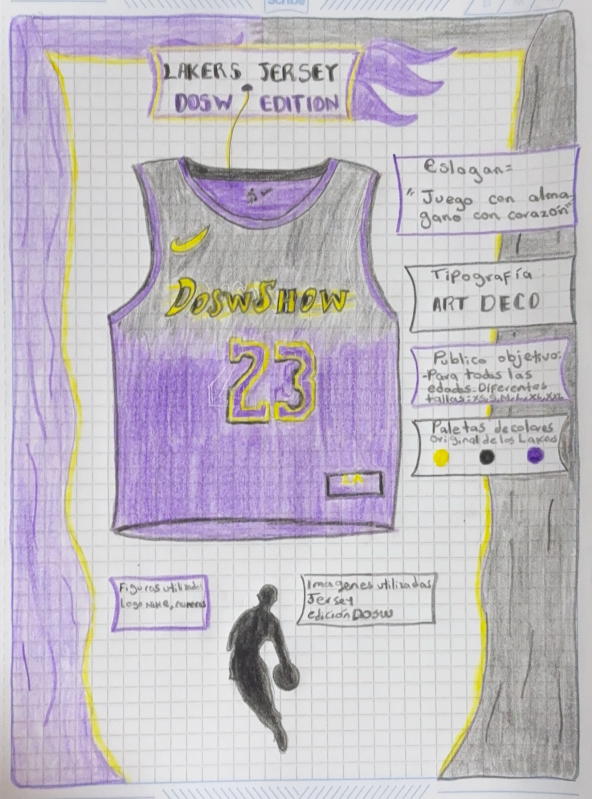

# EJERCICIO DE LOGO 

## Lakers Jersey DOSW Edition

**Eslogan del producto**
- "Juego con alma, gano con corazón"

**Tipografía**
- La tipografía Art Deco es un estilo ya antiguo que se caracteriza por formas geométricas, líneas rectas y simetría. 
Transmite elegancia, modernidad y un aire sofisticado. Justo la tipografía que genera una relacion perfecta entre
el jersey, su equipo y su diseño.

**Público objetivo**
- Apto y perfecto para todas las edades y para todas las personas desde amantes del deporte hasta personas que deseen 
vestir un estilo con unos colores bien elegidos y un diseño sofisticado, se manejan diferentes tallas:
  - XS, S, M, L, XL, XXL

**Paletas de colores**
- Amarillo: Representa grandeza, éxito y legado. Es un símbolo de los campeonatos y la excelencia que define la historia de los Lakers.
- Negro: Evoca fuerza, determinación y sofisticación. Añade una energía intensa y enfocada, mostrando un carácter competitivo y sólido.
- Morado: transmite creatividad, ambición y orgullo. Es el color icónico del equipo, ligado a su identidad emocional y su conexión con la ciudad de Los Ángeles.

**Imagenes utilizadas**

- Jersey Lakers edición DOSW
- logo de la NBA

**Figuras utilizadas**

- Logo Nike
- Numeros